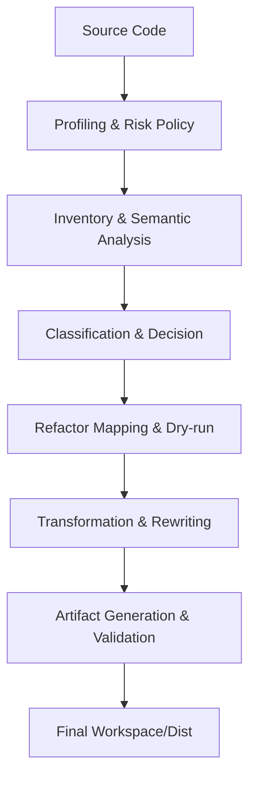

# RisuLua Split Technical Specification & Workflow

이 문서는 RisuLua 소스 코드를 분석하고 멀티 모듈 구조로 재구성하는 `risulua-split` 도메인의 기술 사양과 전체 37개 소스 파일의 상세 역할을 정의합니다.

## 1. 시스템 아키텍처 및 데이터 흐름

전체 프로세스는 원본 소스의 프로파일을 감지하는 것부터 시작하여, 정밀한 의미 분석을 거쳐 물리적인 파일로 분할하기까지의 4단계 파이프라인으로 구성됩니다.

## 2. 핵심 작동 메커니즘 (Core Mechanism)

### 2.1. 정밀 토큰 치환 (module-table-identifier-rewrite.ts)

단순한 텍스트 치환의 한계를 극복하기 위해 Single-Pass Scanner를 사용합니다.

- Context-Aware: `.` 뒤의 속성 참조인지, `(` 앞의 함수 호출인지 토큰 단위로 감지하여 오치환을 방지합니다.
- Reverse-Order Update: 텍스트 치환 시 높은 오프셋(파일 끝)부터 역순으로 적용하여, 치환 후에도 나머지 텍스트의 오프셋 인덱스가 변하지 않도록 관리합니다.

### 2.2. 중첩 핸들러 파라미터화 (module-table-nested-handler-rewrite.ts)

핸들러 내부에 선언된 로컬 함수가 외부 변수를 참조(Capture)하는 경우, 이를 단순 추출하면 스코프가 깨집니다.

- Parameter Injection: 캡처된 변수들을 함수의 파라미터로 강제 전환합니다.
- Call-Site Rewrite: 핸들러 본문에서 해당 함수를 호출하는 모든 지점을 찾아, 캡처되었던 변수들을 인자로 주입하도록 코드를 재작성합니다.

### 2.3. 무결성 보장 슬라이싱 (shared/source-slice.ts)

- Zero-Reprint Policy: AST를 다시 문자열로 그리는 대신, 원본 소스의 바이트 오프셋을 직접 잘라내어(`source.slice`) 주석, 공백, 특수 포맷팅을 100% 보존합니다.
- Gap Detection: 추출된 파편들을 연결할 때 누락된 바이트(Gap)를 검사하여 데이터 유실을 방지합니다.

## 3. 전수 파일 디렉토리 (Full File Directory)

### 3.1. Infrastructure & Shared (7 files)

- `index.ts`: 패키지의 통합 엔트리포인트 및 퍼블릭 API.
- `shared/types.ts`: `RisuLuaSplitPlan`, `LuaTopLevelAtom` 등 도메인 핵심 데이터 구조 정의.
- `shared/utf8-byte-range-map.ts`: JS(UTF-16)와 Lua(UTF-8) 간의 인덱스 정합성 매핑.
- `shared/source-slice.ts`: 오프셋 기반 정밀 텍스트 추출 엔진.
- `shared/range-utils.ts`: 라인/오프셋 변환 및 바이너리 서치 유틸리티.
- `shared/path-policy.ts`: 샌드박스 경로 검증 및 안전한 모듈 경로 생성 정책.
- `shared/offset-range-index.ts`: 대규모 범위 검색을 위한 오프셋 인덱스 구현.

### 3.2. Module-Table Advanced Mode (13 files)

- `module-table-writer.ts`: 모듈 테이블 리팩터링 전체 과정을 지휘하는 오케스트레이터.
- `module-table-analyzer.ts`: 스코프, 심볼 캡처, 호스트 API 효과를 추출하는 의미 분석기.
- `module-table-classifier.ts`: 11단계 우선순위에 따라 추출/브리지/보존 여부를 결정하는 분류기.
- `module-table-parser.ts`: Tree-sitter 기반 파서 및 구문 범위 식별.
- `module-table-refactor-map.ts`: 모든 변경 사항을 사전에 검증하는 Dry-run 계획기.
- `module-table-top-level-rewrite.ts`: 최상위 심볼 분리 및 `main.risulua` 합성 계획.
- `module-table-nested-handler-rewrite.ts`: 중첩 헬퍼 추출 및 파라미터 주입 리라이터.
- `module-table-identifier-rewrite.ts`: 저수준 토큰 스캐너 및 역순 식별자 치환 엔진.
- `module-table-contracts.ts`: 분류 코드, MVP 경로, 도메인 계약 정의.
- `module-table-analyzer-host-effects.ts`: RisuAI 호스트 API의 5가지 영향도 분류.
- `module-table-analyzer-lua-ast.ts`: `luaparse` 호환 AST 탐색 및 헬퍼 유틸리티.
- `module-table-analyzer-types.ts`: 분석 결과물(Fact) 및 스코프 프레임 타입 정의.
- `module-table-rendering.ts`: 리팩터 맵 및 도메인 후보군의 직렬화/렌더링.

### 3.3. Planners & Extractors (7 files)

- `planners/plain-coarse-planner.ts`: 단일 파일 대상의 보수적 원소 단위 분할기.
- `planners/section-recovery-planner.ts`: `[BUNDLE]` 마커 기반 섹션 복구기.
- `planners/preload-recovery-planner.ts`: `package.preload` 기반 모듈 복구기.
- `planners/mixed-preserve-planner.ts`: 복합 구조 감지 시 안전 보존(Fail-closed) 실행기.
- `planners/report-only-planner.ts`: 실제 쓰기 없이 분석 보고서만 생성하는 모드.
- `extractors/section-extractor.ts`: 마커 오프셋 기반 섹션 물리 슬라이싱 추출기.
- `extractors/preload-extractor.ts`: 중첩 함수 깊이를 추적하는 정밀 프리로드 추출기.

### 3.4. Inventory & Profiling (4 files)

- `profiling/source-profile.ts`: 번들 타입 판별 및 분할 신뢰도(Confidence) 산출.
- `profiling/lua-runtime-risk-policy.ts`: `load`, `dofile` 등 위험 코드에 대한 리스크 정책.
- `inventory/top-level-inventory.ts`: AST 기반의 최상위 코드 원소(Atom) 목록 구축.
- `inventory/confidence.ts`: 원소별 추출 안전성 및 도메인 타겟 매칭 로직.

### 3.5. Output & Verification (5 files)

- `output/validators.ts`: 섀도잉, 경로 위반 등 23가지 무결성 검증 로직.
- `output/dist-builder.ts`: 분할된 모듈들을 다시 하나의 파일로 묶는 빌드 전략기.
- `output/workspace-writer.ts`: `lua/`, `legacy/`, `docs/` 워크스페이스 물리적 쓰기.
- `output/plan-writer.ts`: 분할 계획서(`risulua-split-plan.json`) 생성 및 관리.
- `output/report-writer.ts`: 사용자 친화적인 분석 리포트(`risulua-split-report.md`) 생성.

---
