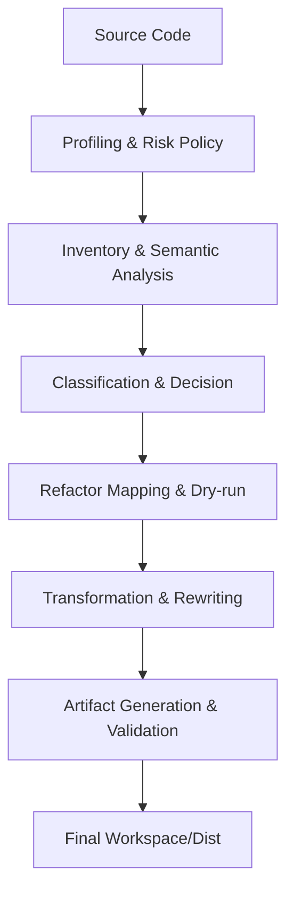

# RisuLua Split Technical Specification & Workflow

이 문서는 RisuLua 소스 코드를 분석하고 멀티 모듈 구조로 재구성하는 `risulua-split` 도메인의 기술 사양과 전체 37개 소스 파일의 상세 역할을 정의합니다.

## 1. 시스템 아키텍처 및 데이터 흐름

전체 프로세스는 원본 소스의 프로파일을 감지하는 것부터 시작하여, 정밀한 의미 분석을 거쳐 물리적인 파일로 분할하기까지의 4단계 파이프라인으로 구성됩니다.


```mermaid
graph TD
    A[Source Code] --> B[Profiling & Risk Policy]
    B --> C[Inventory & Semantic Analysis]
    C --> D[Classification & Decision]
    D --> E[Refactor Mapping & Dry-run]
    E --> F[Transformation & Rewriting]
    F --> G[Artifact Generation & Validation]
    G --> H[Final Workspace/Dist]
```

## 2. 핵심 작동 메커니즘 (Core Mechanism)

### 2.1. 정밀 토큰 치환 (module-table-identifier-rewrite.ts)

단순한 텍스트 치환의 한계를 극복하기 위해 Single-Pass Scanner를 사용합니다.

- Context-Aware: `.` 뒤의 속성 참조인지, `(` 앞의 함수 호출인지 토큰 단위로 감지하여 오치환을 방지합니다.
- Reverse-Order Update: 텍스트 치환 시 높은 오프셋(파일 끝)부터 역순으로 적용하여, 치환 후에도 나머지 텍스트의 오프셋 인덱스가 변하지 않도록 관리합니다.

### 2.2. 중첩 핸들러 파라미터화 (module-table-nested-handler-rewrite.ts)

핸들러 내부에 선언된 로컬 함수가 외부 변수를 참조(Capture)하는 경우, 이를 단순 추출하면 스코프가 깨집니다.

- Parameter Injection: 캡처된 변수들을 함수의 파라미터로 강제 전환합니다.
- Call-Site Rewrite: 핸들러 본문에서 해당 함수를 호출하는 모든 지점을 찾아, 캡처되었던 변수들을 인자로 주입하도록 코드를 재작성합니다.

### 2.3. 무결성 보장 슬라이싱 (shared/source-slice.ts)

- Zero-Reprint Policy: AST를 다시 문자열로 그리는 대신, 원본 소스의 바이트 오프셋을 직접 잘라내어(`source.slice`) 주석, 공백, 특수 포맷팅을 100% 보존합니다.
- Gap Detection: 추출된 파편들을 연결할 때 누락된 바이트(Gap)를 검사하여 데이터 유실을 방지합니다.

## 3. 모놀리식 Lua 분할 시 예상 출력 구조

`risulua-split`은 거대한 단일 Lua 소스나 모든 책임이 한 파일에 모인 모놀리식 Lua를 먼저 `plain-single`, `section-bundle`, `preload-bundle`, `mixed-bundle`, `unknown` 중 하나로 프로파일링하고, 선택된 모드에 따라 `lua/`, `legacy/`, `dist/`, `docs/` 출력 루트를 구성합니다.

### 3.1. 기본 출력 루트

일반적인 split 결과는 다음 네 루트를 기준으로 읽습니다.

```text
<outputRoot>/
├── lua/      # 편집 가능한 분할 Lua source graph
├── legacy/   # 원본 보존 및 복구용 source
├── dist/     # RisuAI에 다시 넣을 단일 bundled Lua 산출물
└── docs/     # split plan, report, refactor map, sidecar index
```

- `lua/main.risulua`는 대부분의 모드에서 entry point입니다. `module-table`에서는 host ABI shell에 가깝고, coarse fallback에서는 composition root 또는 보존 shell 역할을 합니다.
- `legacy/original.risulua`는 원본 소스를 byte-for-byte로 보존하는 감사/복구 파일입니다. report-only를 제외한 실제 workspace 생성 경로에서 기본적으로 유지합니다.
- `docs/risulua-split-plan.json`은 machine-readable 계획이며, `docs/risulua-split-report.md`는 사람이 읽는 요약 리포트입니다.
- `dist/<targetName>.risulua`는 packable한 계획에서만 생성됩니다. RisuAI 런타임은 공식적으로 multi-file Lua tree를 직접 실행하는 형식이 아니므로, 최종 배포는 단일 Lua 산출물 기준으로 생각합니다.

현재 구현이 자동 생성할 수 있는 `lua/` 하위 디렉토리의 전체 범위는 아래 정도로 제한됩니다. `services/`, `models/`, `repositories/`, `ui/`, `commands/` 같은 일반 애플리케이션식 계층은 아직 자동 생성 계약에 포함되어 있지 않습니다.

| 생성 계열                    | 가능한 `lua/` 하위 디렉토리                                                                                    |
| ---------------------------- | -------------------------------------------------------------------------------------------------------------- |
| module-table 권장 구조       | `common/`, `host_globals/`, `button_actions/`, `state/`, `prompts/`, `runtime/`, `handler_helpers/`, `domain/` |
| plain-single coarse fallback | `common/`, `runtime/`, `schema/`, `features/`                                                                  |
| section-bundle recovery      | `sections/`                                                                                                    |
| preload-bundle recovery      | `preload/`                                                                                                     |

즉 모놀리식 Lua를 자동으로 “큰 프로젝트 폴더 구조”처럼 여러 domain layer로 펼치는 단계까지는 가지 않습니다. 현재 목표는 안전한 host ABI shell, runtime hook, helper, state/prompt store, action, domain candidate 정도로 분류하고, 더 세밀한 도메인 구조는 `docs/refactor-map.json`과 `docs/domain-candidates.json`을 보고 사람이 후속 설계하는 흐름입니다.

### 3.2. 예상 폴더 구조 문서

전체 tree는 별도 문서인 [OUTPUT_STRUCTURE.md](./OUTPUT_STRUCTURE.md)에 둡니다. `WORKFLOW.md`에서는 긴 tree를 반복하지 않고, 현재 자동 분류의 핵심 축만 짧게 유지합니다.

> **계획된 split 산출물과 starter editing surface의 차이**
>
> `risulua-split`/extract의 분석 계획은 안전성을 우선하기 때문에 실제 소스에서 해당 패턴, 심볼, source profile, fallback 경로가 감지된 항목만 `docs/risulua-split-plan.json`과 dist require graph에 포함합니다. 예를 들어 button action이 없으면 실제 action 추출 계획을 만들지 않고, section/preload recovery도 해당 marker나 `package.preload`가 있을 때만 계획에 들어갑니다.
>
> 다만 실제 workspace를 쓸 때는 후속 LLM/사용자 개발이 참고할 수 있도록, 감지되지 않은 표준 module 위치도 비어 있는 `local M = {}; return M` starter 파일로 보강할 수 있습니다. 이 starter editing surface는 split plan이나 dist graph의 “실제로 감지된 것만 포함” 정책을 바꾸지 않고, 편집 가능한 폴더/파일 표면만 미리 열어 주는 역할입니다. `risu-core scaffold --risulua-mode modular`도 같은 목적의 full starter layout을 새 프로젝트 시작점으로 제공합니다.

```text
lua/main.risulua          # host ABI shell / composition root
lua/runtime/              # RisuAI lifecycle hook
lua/handler_helpers/      # hook 내부 helper
lua/common/               # 순수 helper
lua/host_globals/         # public/global bridge 구현
lua/button_actions/       # 버튼 trigger action
lua/state/                # variable store
lua/prompts/              # prompt/instruction constants
lua/domain/               # 의미 단위 후보
lua/schema/, features/    # coarse fallback 전용
lua/sections/, preload/   # recovery fallback 전용
```

### 3.3. Module-Table 모드: 모놀리식 Lua 권장 구조

큰 plain-single Lua를 의미 분석까지 거쳐 나누는 기본 권장 구조는 `module-table` 모드입니다. 이 모드는 `module-table-contracts.ts`의 고정 경로와 classifier의 동적 경로를 조합합니다.

```text
<outputRoot>/
├── lua/
│   ├── main.risulua
│   ├── common/
│   │   └── local_helpers.risulua
│   ├── host_globals/
│   │   ├── global_functions.risulua
│   │   ├── duplicate_globals.risulua
│   │   └── async_actions.risulua
│   ├── button_actions/
│   │   ├── actions.risulua
│   │   └── <action_name>.risulua        # 필요 시 동적 생성
│   ├── state/
│   │   └── variable_store.risulua
│   ├── prompts/
│   │   └── instruction_store.risulua
│   ├── runtime/
│   │   ├── output.risulua
│   │   ├── input.risulua
│   │   ├── start.risulua
│   │   ├── button_click.risulua
│   │   └── listen_edit.risulua
│   ├── handler_helpers/
│   │   └── <handler>_helpers.risulua    # 예: output_helpers.risulua
│   └── domain/
│       └── <domain_function>.risulua    # validate_order 같은 의미 단위 후보
├── legacy/
│   └── original.risulua
├── docs/
│   ├── risulua-split-plan.json
│   ├── risulua-split-report.md
│   ├── refactor-map.json
│   ├── domain-candidates.json
│   ├── risulua-export-manifest.json
│   └── risulua-button-action-index.json
└── dist/
    └── <targetName>.risulua
```

주요 파일 역할은 다음과 같습니다.

| 경로                                         | 역할                                                                                                          |
| -------------------------------------------- | ------------------------------------------------------------------------------------------------------------- |
| `lua/main.risulua`                           | RisuAI가 보는 host-visible global, require binding, bridge assignment를 남기는 entry shell.                   |
| `lua/common/local_helpers.risulua`           | host write, UI interaction, async boundary가 없는 순수 local helper.                                          |
| `lua/host_globals/global_functions.risulua`  | 안전하게 bridge 가능한 public/global 함수 구현.                                                               |
| `lua/host_globals/duplicate_globals.risulua` | source order를 보존해야 하는 중복 public global 구현.                                                         |
| `lua/host_globals/async_actions.risulua`     | `LLM`, `request`, `async` 등 async/model/network 효과가 있는 action.                                          |
| `lua/button_actions/actions.risulua`         | `risu-trigger` 또는 `{{button::...}}`에서 도달하는 button action.                                             |
| `lua/state/variable_store.risulua`           | top-level variable table 저장소.                                                                              |
| `lua/prompts/instruction_store.risulua`      | prompt/instruction 상수 저장소.                                                                               |
| `lua/runtime/*.risulua`                      | `onStart`, `onInput`, `onOutput`, `onButtonClick`, `listenEdit` runtime boundary body.                        |
| `lua/handler_helpers/*_helpers.risulua`      | handler 내부 helper를 capture parameter 주입 후 분리한 모듈.                                                  |
| `lua/domain/*.risulua`                       | 의미 단위 domain function 후보. 기본은 report-only 후보일 수 있고, `domainGeneration` 정책에 따라 생성됩니다. |
| `docs/refactor-map.json`                     | 어떤 심볼이 어느 module로 이동했는지 검증하는 dry-run map.                                                    |
| `docs/domain-candidates.json`                | domain 후보와 생성/차단 상태 sidecar.                                                                         |
| `docs/risulua-export-manifest.json`          | host-visible globals, duplicate groups, preserved reasons manifest.                                           |
| `docs/risulua-button-action-index.json`      | button action name과 사용처를 연결하는 navigation sidecar.                                                    |

### 3.4. Coarse 모드 fallback 구조

`module-table`을 쓰지 않거나, 입력이 plain-single이 아닌 경우에는 coarse 계열 planner가 보수적으로 분할합니다.

#### 3.4.1. Plain-single coarse

```text
<outputRoot>/
├── lua/
│   ├── main.risulua
│   ├── common/
│   │   ├── helpers.risulua
│   │   └── local_helpers.risulua
│   ├── runtime/
│   │   ├── start.risulua
│   │   ├── input.risulua
│   │   ├── output.risulua
│   │   ├── button_click.risulua
│   │   └── listeners.risulua
│   ├── schema/
│   │   └── constants.risulua
│   └── features/
│       └── core.risulua
├── legacy/original.risulua
├── docs/risulua-split-plan.json
├── docs/risulua-split-report.md
└── dist/<targetName>.risulua
```

이 구조는 `inventory/confidence.ts`의 coarse target mapping을 따릅니다. 안전한 pure helper나 constants는 별도 파일로 나가고, host state write나 동적 key처럼 위험도가 높은 블록은 `lua/main.risulua` 또는 `lua/features/core.risulua` 중심으로 보존됩니다.

#### 3.4.2. Section-bundle recovery

```text
<outputRoot>/
├── lua/
│   ├── main.risulua
│   └── sections/
│       ├── 00_<label>.risulua
│       ├── 10_<label>.risulua
│       └── 90_<label>.risulua
├── legacy/original.risulua
├── docs/risulua-split-plan.json
├── docs/risulua-split-report.md
└── dist/<targetName>.risulua
```

`[BUNDLE]` marker가 있는 소스는 섹션 순서를 `docs/risulua-split-plan.json`에 기록하고, dist는 section-order concat으로 생성합니다. 이때 `lua/sections/*.risulua`는 독립 require module이 아니라 순서 의존 chunk fragment입니다.

#### 3.4.3. Preload-bundle recovery

```text
<outputRoot>/
├── lua/
│   ├── main.risulua
│   └── preload/
│       ├── <preload_id>.risulua
│       └── <preload_id>__2.risulua
├── legacy/original.risulua
├── docs/risulua-split-plan.json
└── docs/risulua-split-report.md
```

`package.preload[...] = function(...) ... end` 형태의 bundle은 wrapper body를 `lua/preload/` 아래로 복구합니다. 현재 이 프로파일은 `packable=false`이며, `dist/`를 생성하지 않습니다.

#### 3.4.4. Mixed/unknown preserve-first

```text
<outputRoot>/
├── lua/
│   ├── main.risulua
│   ├── sections/      # 감지된 section이 있을 때만
│   └── preload/       # 감지된 preload가 있을 때만
├── legacy/original.risulua
├── docs/risulua-split-plan.json
└── docs/risulua-split-report.md
```

mixed 또는 unknown 입력은 fail-closed 정책을 사용합니다. 불확실한 semantic regrouping이나 require 합성을 하지 않고, `lua/main.risulua`와 `legacy/original.risulua`를 기준으로 수동 복구/검토를 유도합니다.

### 3.5. Report-only 모드

```text
<outputRoot>/
└── docs/
    ├── risulua-split-plan.json
    └── risulua-split-report.md
```

report-only 모드는 실제 Lua workspace를 쓰지 않고 분석 산출물만 생성합니다. 자동 분할의 안전성을 먼저 확인하거나, source profile과 위험 블록만 확인할 때 사용합니다.

### 3.6. 경로를 바꾸고 싶을 때 확인할 파일

| 변경 대상                    | 기준 파일/함수                                                                   |
| ---------------------------- | -------------------------------------------------------------------------------- |
| module-table 고정 경로       | `module-table/module-table-contracts.ts`의 `RISULUA_MODULE_TABLE_*_PATH`         |
| domain function 파일명       | `module-table/module-table-classifier.ts`의 `domainFunctionPath()`               |
| handler helper 파일명        | `module-table/module-table-classifier.ts`의 `handlerHelperPath()`                |
| coarse handler/helper target | `inventory/confidence.ts`의 `HANDLER_TARGET_MAP`, `classifyAtomForCoarseSplit()` |
| section recovery path        | `extractors/section-extractor.ts`의 section path 생성 로직                       |
| preload recovery path        | `extractors/preload-extractor.ts`의 preload path 생성 로직                       |
| plan/report 위치             | `output/plan-writer.ts`, `output/report-writer.ts`                               |
| dist 생성 방식               | `output/dist-builder.ts`                                                         |
| 물리적 파일 쓰기             | `output/workspace-writer.ts`                                                     |

## 4. 전수 파일 디렉토리 (Full File Directory)

### 4.1. Infrastructure & Shared (7 files)

- `index.ts`: 패키지의 통합 엔트리포인트 및 퍼블릭 API.
- `shared/types.ts`: `RisuLuaSplitPlan`, `LuaTopLevelAtom` 등 도메인 핵심 데이터 구조 정의.
- `shared/utf8-byte-range-map.ts`: JS(UTF-16)와 Lua(UTF-8) 간의 인덱스 정합성 매핑.
- `shared/source-slice.ts`: 오프셋 기반 정밀 텍스트 추출 엔진.
- `shared/range-utils.ts`: 라인/오프셋 변환 및 바이너리 서치 유틸리티.
- `shared/path-policy.ts`: 샌드박스 경로 검증 및 안전한 모듈 경로 생성 정책.
- `shared/offset-range-index.ts`: 대규모 범위 검색을 위한 오프셋 인덱스 구현.

### 4.2. Module-Table Advanced Mode (13 files)

- `module-table-writer.ts`: 모듈 테이블 리팩터링 전체 과정을 지휘하는 오케스트레이터.
- `module-table-analyzer.ts`: 스코프, 심볼 캡처, 호스트 API 효과를 추출하는 의미 분석기.
- `module-table-classifier.ts`: 11단계 우선순위에 따라 추출/브리지/보존 여부를 결정하는 분류기.
- `module-table-parser.ts`: Tree-sitter 기반 파서 및 구문 범위 식별.
- `module-table-refactor-map.ts`: 모든 변경 사항을 사전에 검증하는 Dry-run 계획기.
- `module-table-top-level-rewrite.ts`: 최상위 심볼 분리 및 `main.risulua` 합성 계획.
- `module-table-nested-handler-rewrite.ts`: 중첩 헬퍼 추출 및 파라미터 주입 리라이터.
- `module-table-identifier-rewrite.ts`: 저수준 토큰 스캐너 및 역순 식별자 치환 엔진.
- `module-table-contracts.ts`: 분류 코드, MVP 경로, 도메인 계약 정의.
- `module-table-analyzer-host-effects.ts`: RisuAI 호스트 API의 5가지 영향도 분류.
- `module-table-analyzer-lua-ast.ts`: `luaparse` 호환 AST 탐색 및 헬퍼 유틸리티.
- `module-table-analyzer-types.ts`: 분석 결과물(Fact) 및 스코프 프레임 타입 정의.
- `module-table-rendering.ts`: 리팩터 맵 및 도메인 후보군의 직렬화/렌더링.

### 4.3. Planners & Extractors (7 files)

- `planners/plain-coarse-planner.ts`: 단일 파일 대상의 보수적 원소 단위 분할기.
- `planners/section-recovery-planner.ts`: `[BUNDLE]` 마커 기반 섹션 복구기.
- `planners/preload-recovery-planner.ts`: `package.preload` 기반 모듈 복구기.
- `planners/mixed-preserve-planner.ts`: 복합 구조 감지 시 안전 보존(Fail-closed) 실행기.
- `planners/report-only-planner.ts`: 실제 쓰기 없이 분석 보고서만 생성하는 모드.
- `extractors/section-extractor.ts`: 마커 오프셋 기반 섹션 물리 슬라이싱 추출기.
- `extractors/preload-extractor.ts`: 중첩 함수 깊이를 추적하는 정밀 프리로드 추출기.

### 4.4. Inventory & Profiling (4 files)

- `profiling/source-profile.ts`: 번들 타입 판별 및 분할 신뢰도(Confidence) 산출.
- `profiling/lua-runtime-risk-policy.ts`: `load`, `dofile` 등 위험 코드에 대한 리스크 정책.
- `inventory/top-level-inventory.ts`: AST 기반의 최상위 코드 원소(Atom) 목록 구축.
- `inventory/confidence.ts`: 원소별 추출 안전성 및 도메인 타겟 매칭 로직.

### 4.5. Output & Verification (5 files)

- `output/validators.ts`: 섀도잉, 경로 위반 등 23가지 무결성 검증 로직.
- `output/dist-builder.ts`: 분할된 모듈들을 다시 하나의 파일로 묶는 빌드 전략기.
- `output/workspace-writer.ts`: `lua/`, `legacy/`, `docs/` 워크스페이스 물리적 쓰기.
- `output/plan-writer.ts`: 분할 계획서(`risulua-split-plan.json`) 생성 및 관리.
- `output/report-writer.ts`: 사용자 친화적인 분석 리포트(`risulua-split-report.md`) 생성.

---
