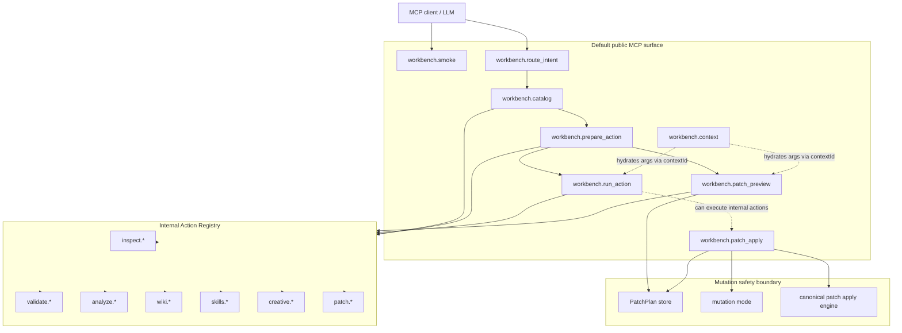

# risuai-workbench-mcp reference

이 문서는 `risuai-workbench-mcp`의 상세 운영/구현 reference입니다.
문서 탐색은 [README.md](./README.md), 짧은 설치와 사용법은 [docs/setup.md](./docs/setup.md)와 [docs/workflows.md](./docs/workflows.md)를 확인하세요.

RisuAI Workbench의 Canonical Workspace를 AI agent가 안전하게 읽고, 검증하고, 필요한 경우 Workbench mutation tool로 수정할 수 있게 해 주는 local stdio MCP server입니다.

이 패키지는 facade MCP surface를 기본으로 노출합니다. 기본 `tools/list`는 8개 facade tool만 반환하며, 기존 domain tool들은 내부 Action Registry action으로 실행됩니다.

Creative thinking surface의 method와 rubric은 MCP resource card로 제공됩니다.

## 제공 기능

- **Inspect / Validate**: artifact path, root marker, `_order.json`, frontmatter, metadata, canonical path를 검사합니다.
- **Analyze / Impact**: variable flow, Lua analysis/call graph/state access, button action, relationship network, prompt chain, composition conflict, dead-code, token budget을 조회합니다.
- **Preview / Patch Plan**: 실제 write 없이 structured patch plan과 diff를 생성합니다.
- **Direct Mutation**: 승인된 patch plan, `_order.json`, frontmatter, metadata, artifact 생성/이동/삭제, generated wiki bootstrap/refresh를 처리합니다.
- **Core Workflows**: `risu-core extract` / `risu-core scaffold`를 MCP mutation workflow로 실행합니다.
- **Creative Thinking**: workspace/analyze/wiki context를 바탕으로 아이디어를 만들고, 선택된 아이디어만 PatchPlan preview/apply로 연결합니다.
- **Resources / Prompts**: wiki/rule/schema/analyze/mutation context resource와 agent workflow prompt를 제공합니다.

## Default facade tool surface

기본 실행에서 외부 MCP `tools/list`에 노출되는 tool은 정확히 다음 8개입니다. Resources와 prompts는 기본으로 계속 사용할 수 있습니다.

| MCP tool | 역할 | Mutation |
| --- | --- | --- |
| `workbench.smoke` | server와 workspace 상태를 확인합니다. | no |
| `workbench.route_intent` | 사용자 요청을 capability, risk, 추천 internal action 후보로 라우팅합니다. | no |
| `workbench.catalog` | 현재 intent에 맞는 내부 action 후보만 짧게 반환합니다. | no |
| `workbench.prepare_action` | 선택한 internal action 하나의 입력 가이드와 예시를 반환합니다. | no |
| `workbench.run_action` | 내부 action을 schema 검증 후 실행합니다. | action-dependent |
| `workbench.context` | 큰 context payload를 handle로 만들고, 읽고, 검색하고, 해제합니다. | no |
| `workbench.patch_preview` | patch preview action 또는 patch plan pass-through를 실행하고 plan을 저장합니다. | preview only |
| `workbench.patch_apply` | 저장된 patch plan을 적용합니다. | commit |

일반 workflow는 facade 순서를 따릅니다.

```text
workbench.route_intent
  -> workbench.catalog
  -> workbench.prepare_action
  -> workbench.run_action
```

파일 변경 workflow는 mutation safety gate를 따릅니다.

```text
workbench.route_intent
  -> workbench.catalog
  -> workbench.prepare_action
  -> workbench.patch_preview
-> apply stored plan
  -> workbench.patch_apply
```

`catalog`와 `prepare_action`이 반환하는 `actionId` 값은 MCP tool 이름이 아니라 내부 Action Registry ID입니다. 예: `inspect.path`, `analyze.query_lua_analysis`, `creative.brainstorm_scamper`, `patch.suggest_order`.

## Facade architecture map

The MCP server uses a small public facade and keeps domain-specific behavior behind an internal Action Registry.



The facade reduces the external MCP `tools/list` surface while preserving the full domain capability internally. `route_intent` decides the likely capability, `catalog` exposes relevant internal actions, `prepare_action` explains one action schema, `run_action` executes internal actions, `context` carries large payloads by handle, and `patch_preview` / `patch_apply` provide a structured path for file writes.

For generated Mermaid diagrams and graph JSON, run:

```bash
npm run build --workspace risuai-workbench-mcp
npm run facade:visualize --workspace risuai-workbench-mcp
```

Legacy MCP tools are hidden by default. Set `RISU_MCP_EXPOSE_LEGACY_TOOLS=1` only for development, migration testing, or backward compatibility checks that intentionally need the old direct tool surface.

## MCP protocol compliance

This package runs as a local MCP server over stdio and uses the official `@modelcontextprotocol/sdk` lifecycle.
The client starts the process, sends `initialize`, receives server information and negotiated capabilities, sends `notifications/initialized`, and then calls the advertised tools, resources, and prompts.

Server info is derived from `package.json`:

| Field | Value |
| --- | --- |
| `name` | `risuai-workbench-mcp` |
| `version` | package version |

Implemented MCP capabilities:

| Capability | Status | Notes |
| --- | --- | --- |
| `tools` | implemented | Static registry during one server session; no list-changed notifications are emitted. |
| `resources` | implemented | Read-only resource templates and selected materialized JSON/text resources. |
| `prompts` | implemented | Workflow-only prompt templates; prompts never mutate files. |
| `logging` | not declared | Operational logs use stderr; MCP `notifications/message` is not emitted. |
| `completions` | not declared | Completion handlers are not registered. |
| `tasks` | not declared | MCP tasks are experimental and not part of this server surface. |

## 요구사항

- Node.js 20 이상
- MCP-compatible client
- RisuAI Workbench workspace root
- 이 저장소에서 source 실행 시 root dependency install 및 build 필요

## 설치 및 빌드

저장소에서 직접 사용할 때:

```bash
npm install
npm run build --workspace risuai-workbench-mcp
```

도움말 확인:

```bash
node packages/risuai-workbench-mcp/bin/risuai-workbench-mcp.js --help
```

## Server lifecycle

Startup flow:

1. CLI parses `--stdio`.
2. `startStdioServer()` resolves the workspace root and creates the MCP server.
3. The SDK handles MCP `initialize`, protocol negotiation, and `notifications/initialized`.
4. Clients may call `tools/list`, `tools/call`, `resources/templates/list`, `resources/read`, `prompts/list`, and `prompts/get`.
5. Shutdown is handled by the stdio transport when the client closes the child process streams.

## Transport

This package currently supports MCP stdio transport only.

Rules:

- stdout is reserved for MCP JSON-RPC messages while `--stdio` is active.
- Operational diagnostics and warnings must be written to stderr.
- Human-readable `--help` and `--version` output is allowed only before MCP stdio starts.
- Child process stdout/stderr from wrapped workflows is captured and returned through structured tool results instead of being forwarded to server stdout.

## MCP client 설정

### Claude Desktop / Cursor 계열 `mcpServers`

```json
{
  "mcpServers": {
    "risuai-workbench": {
      "type": "stdio",
      "command": "node",
      "args": [
        "./packages/risuai-workbench-mcp/bin/risuai-workbench-mcp.js",
        "--stdio"
      ]
    }
  }
}
```

### VS Code style `servers`

```json
{
  "servers": {
    "risuai-workbench": {
      "type": "stdio",
      "command": "node",
      "args": [
        "./packages/risuai-workbench-mcp/bin/risuai-workbench-mcp.js",
        "--stdio"
      ]
    }
  }
}
```

## CLI

```bash
risuai-workbench-mcp --stdio
risuai-workbench-mcp --help
risuai-workbench-mcp --version
```

| 옵션 | 기본값 | 설명 |
| --- | --- | --- |
| `--stdio` | 없음 | MCP stdio server를 시작합니다. stdout은 JSON-RPC 전용입니다. |
| `--help` | 없음 | stdio 시작 없이 사용법을 출력합니다. |
| `--version` | 없음 | package version을 출력합니다. |

## Path resolution

Current behavior:

- User-provided file paths may be relative or absolute. Relative paths are resolved from the startup context.
- MCP client-provided `roots` are not queried yet.

Future behavior may use client-provided MCP roots as context hints when the client declares the `roots` capability.

## Error policy

The server distinguishes MCP protocol errors from tool execution results.

- Unknown tools, malformed MCP requests, and transport-level failures are handled by the MCP SDK as JSON-RPC protocol errors.
- Domain validation failures, unsafe paths, stale states, and mutation failures are returned as structured tool results.
- Tool execution errors remain actionable for the model by returning diagnostic or mutation envelopes with rule IDs and messages.

## Tool response format

Compatibility mode:

- Every tool result includes `content[0].type = "text"`.
- `content[0].text` contains serialized JSON for the envelope or payload.

Structured mode:

- Tools with stable envelope schemas also return `structuredContent`.
- Tools with stable envelope schemas declare `outputSchema` through the MCP SDK.
- Text JSON is preserved for clients that do not consume structured output.

## Long-running operations

Current behavior:

- Long-running actions return a final diagnostic or mutation envelope.
- Internal legacy actions for extract/scaffold may emit `notifications/progress` when a client supplies `_meta.progressToken`; access them through the facade flow unless legacy dev mode is explicitly enabled.
- MCP task-augmented execution is not implemented.

Cancellation support:

- The extract and scaffold handlers observe MCP request cancellation through the SDK-provided `AbortSignal`.
- If cancellation is observed before child process execution, the tool returns a structured cancellation diagnostic without writing files.
- If cancellation is observed while a wrapped `risu-core` child process is running, the server sends `SIGTERM` to the child process and returns a structured result describing the cancellation state and any observed output files.
- Mid-child cancellation is represented through command cancellation diagnostics and a failed mutation result after post-validation and journal handling.
- Cancellation does not bypass structured mutation handling or post-validation reporting.

## Logging and sensitive data

The server does not declare the MCP `logging` capability.
Operational logs and startup warnings use stderr.

Logs, diagnostics, and progress messages must not include credentials, access tokens, unnecessary personal information, or host-specific secrets.

## Write behavior

- path input은 상대 경로와 absolute path를 모두 받을 수 있습니다. 상대 경로는 startup context 기준으로 해석합니다.
- patch plan과 mutation tool은 Workbench mutation result envelope와 append-only journal을 사용합니다.
- mutation 결과는 append-only journal에 기록됩니다.

Tool annotation은 client/user를 위한 힌트일 뿐이며, 실제 보호는 서버의 safety gate가 수행합니다.

## Creative thinking surface

Creative 기능은 일반-purpose brainstorm app이 아니라 RisuAI Workbench artifact 변경을 안전하게 구상하고 검증하기 위한 agent-facing MCP surface이며, 다음 경계를 지킵니다.

### Read-only creative actions

다음 creative 기능은 기본 facade flow에서 internal action으로 선택됩니다. Caller가 제공한 compact context, analyze/wiki/graph 요약, idea/session payload를 읽고 deterministic/advisory 결과만 반환합니다. 파일, session store, analyze snapshot, wiki, graph를 자동으로 쓰거나 새로 고치지 않습니다.

| Action group | Internal action IDs |
| --- | --- |
| Context | `creative.gather_context`, `creative.inspect_context`, `creative.search_context` |
| Ideation | `brainstorm_scamper`, `create_matrix`, `generate_combinations`, `extract_contradictions`, `suggest_contradiction_resolutions` |
| Convergence / critique | `critique_six_hats`, `rank_ideas`, `cluster_ideas`, `deduplicate_ideas`, `search_idea_graph`, `open_idea_neighborhood`, `red_team_concept` |
| Analyze-backed advisory | `preview_creative_impact`, `find_graph_bridge_ideas`, `critique_idea_with_analyze`, `remix_dead_code_into_ideas`, `optimize_prompt_chain_insertion` |

### Preview and PatchPlan conversion

- `creative.turn_idea_into_plan` returns an implementation plan for one selected idea through facade action execution.
- `creative.turn_idea_into_patch_plan` converts one selected idea into the existing `risuai-workbench-mcp.patch-plan` contract and stores only preview metadata in the in-memory PatchPlan store.
- `creative.preview_idea_patch` reads a stored idea PatchPlan and returns diff/diagnostic/resource-link context without applying it.
- Raw edit authority is rejected at the creative boundary: callers cannot provide arbitrary diffs, shell commands, replacement text, raw operation arrays, or generated file bodies through creative apply.

### Explicit persistence

- `creative.save_idea_session` writes only after explicit facade-routed action invocation into workspace-local `.risuai-workbench-mcp/creative/sessions/{sessionId}.json`.
- `creative.write_idea_memory` writes only after explicit facade-routed action invocation into workspace-local `.risuai-workbench-mcp/creative/memory/{memoryId}.json`.
- Read-only ideation/ranking/critique tools do not auto-save sessions, global memory, or cross-workspace state.

### Creative apply

`creative.apply_idea_patch` is an internal action over the existing patch apply engine. Default callers can use `workbench.patch_preview` then `workbench.patch_apply`; post-validation behavior, append-only journal, and backup/rollback metadata reporting apply. It may return non-blocking `nextActions` such as analyze/wiki refresh or rollback review, but it does not execute those actions automatically.

### Creative resources and prompts

Creative resources are read-only KB/reference surfaces:

| Resource | URI template | Status |
| --- | --- | --- |
| `workbench.creative.resource.methods` | `risuai-workbench://methods` | implemented method catalog |
| `workbench.creative.resource.method.scamper` | `risuai-workbench://methods/scamper` | implemented method card |
| `workbench.creative.resource.method.six_hats` | `risuai-workbench://methods/six-hats` | implemented method card |
| `workbench.creative.resource.method.morphological_analysis` | `risuai-workbench://methods/morphological-analysis` | implemented method card |
| `workbench.creative.resource.method.triz` | `risuai-workbench://methods/triz` | implemented method card |
| `workbench.creative.resource.method.reverse_brainstorming` | `risuai-workbench://methods/reverse-brainstorming` | implemented method card |
| `workbench.creative.resource.rubric.idea_quality` | `risuai-workbench://rubrics/idea-quality` | implemented rubric card |
| `workbench.creative.resource.rubric.artifact_fit` | `risuai-workbench://rubrics/artifact-fit` | implemented rubric card |
| `workbench.creative.resource.idea_session` | `risuai-workbench://ideas/sessions/{sessionId}` | stable read-only URI family; missing sessions return `not_found` |
| `workbench.creative.resource.idea` | `risuai-workbench://ideas/{ideaId}` | stable read-only URI family; missing ideas return `not_found` |
| `workbench.creative.resource.idea_patch_plan` | `risuai-workbench://ideas/{ideaId}/patch-plan` | reads stored idea PatchPlan when available; otherwise `not_found` |

Creative prompts are workflow templates only. They can describe safe sequences such as context gathering, SCAMPER, Six Hats review, contradiction resolution, turning an idea into a patch preview, or applying a selected idea through external gated tools. Prompt execution itself does not mutate files.

### Limitations and non-targets

Not implemented by design: UI/webview, automatic wiki refresh, automatic graph rebuild, automatic analyze refresh, automatic rollback, background agents, global memory, cross-workspace sharing, server-side LLM sampling, or automatic application of every generated idea. Creative tools do not replace graphify/code-review-graph, and they do not overwrite artifacts without validation and the existing mutation gate.

## Tools and internal actions

The default external MCP tool surface is the 8-tool facade listed above. The following names are internal action coverage and legacy/dev-mode MCP tool references, not the normal default `tools/list` surface. In default mode, call them through `workbench.route_intent`, `workbench.catalog`, `workbench.prepare_action`, and either `workbench.run_action` or the patch preview/apply flow.

To expose the old direct MCP tool names for migration testing, start the server with `RISU_MCP_EXPOSE_LEGACY_TOOLS=1`.

### Inspect / Validate internal actions and legacy tools

| Tool | Mutates | 설명 |
| --- | ---: | --- |
| `workbench.smoke` | no | server startup smoke 응답을 반환합니다. |
| `workbench.inspect_path` | no | path가 artifact/root/marker/metadata 중 어떤 역할인지 설명합니다. |
| `workbench.inspect_artifact` | no | artifact root의 contract, files, markers, docs 요약을 반환합니다. |
| `workbench.validate_artifact` | no | artifact root 전체 구조를 검증합니다. |
| `workbench.validate_path` | no | canonical directory, suffix, stem policy를 검증합니다. |
| `workbench.validate_order` | no | `_order.json`과 실제 canonical files 간 일관성을 검증합니다. |
| `workbench.validate_root_markers` | no | `.risuchar` / `.risumodule` marker conflict와 schema 상태를 검증합니다. |
| `workbench.validate_metadata` | no | structured metadata owner와 legacy/deferred surface를 판정합니다. |
| `workbench.validate_frontmatter` | no | delimiter, field schema, round-trip 위험을 검증합니다. |
| `workbench.build_path` | no | target/artifact/stem 입력으로 canonical relative path를 생성합니다. |
| `workbench.search_wiki` | no | docs/wiki/rules 검색 surface입니다. 현재 구현은 제한적이며 info diagnostic을 반환할 수 있습니다. |
| `workbench.suggest_tests` | no | 변경 path 기반 focused test 후보 surface입니다. 현재 구현은 제한적이며 info diagnostic을 반환할 수 있습니다. |

### Analyze / Impact internal actions and legacy tools

| Tool | Mutates | 설명 |
| --- | ---: | --- |
| `workbench.query_variable_flow` | no | 변수 read/write flow와 diagnostics를 조회합니다. |
| `workbench.query_variable` | no | 단일 변수의 reader, writer, event, diagnostics를 조회합니다. |
| `workbench.query_lua_analysis` | no | Lua analysis artifact를 agent-facing JSON view로 정규화합니다. |
| `workbench.query_lua_call_graph` | no | Lua handler/function call graph를 조회합니다. |
| `workbench.query_lua_state_access` | no | Lua state/chat variable read/write occurrence를 조회합니다. |
| `workbench.query_button_actions` | no | button action declaration과 usage를 조회합니다. |
| `workbench.query_relationship_network` | no | relationship graph node/edge/group을 조회합니다. |
| `workbench.query_prompt_chain` | no | prompt chain dependency와 issue를 조회합니다. |
| `workbench.query_composition_conflicts` | no | artifact composition conflict와 compatibility score를 조회합니다. |
| `workbench.query_dead_code_findings` | no | cleanup/dead-code 후보를 조회합니다. |
| `workbench.query_token_budget` | no | token budget summary와 threshold warning을 조회합니다. |
| `workbench.refresh_analyze_snapshot` | no | source mutation 후 analyze snapshot metadata를 새로 계산합니다. |
| `workbench.explain_risulua_workspace` | no | Source-first split RisuLua workspace authoring guide for `lua/main.risulua`, `lua/**/*.risulua`, and generated `dist/<targetName>.risulua` boundaries. |
| `workbench.guide_risulua_module` | no | RisuLua source module guide. Static `require("module.id")` is valid authoring syntax and not an authoring violation. |
| `workbench.explain_risulua_runtime_api` | no | RisuAI Lua lifecycle and runtime API guide based on `LUA_FOR_LLM.md`, type declarations, and core API metadata. |
| `workbench.query_risulua_api` | no | RisuLua host function catalog에서 category, access tier, signature, docs, related functions, reference URI를 조회합니다. |
| `workbench.explain_lorebook_prompt_injection` | no | Lorebook prompt injection and context activation guide, including decorator and recursive activation references. |
| `workbench.explain_context_feedback_loop` | no | Explains `Lorebook -> Structured Output -> Regex -> Button -> RisuLua -> Variable/Lorebook -> Lorebook`. |
| `workbench.plan_structured_output_loop` | no | Plans a source-first structured output, regex, button, Lua state, Lorebook feedback loop without packaging scope. |

RisuLua lifecycle guide tools are authoring guides. They do not preview bundled dist output, do not validate package/export readiness, and do not treat source module `require("module.id")` as a violation. Final generated dist must not retain unresolved executable runtime `require`, but that packaging check is outside this guide family.

### Preview / Patch Plan internal actions and legacy tools

| Tool | Mutates | 설명 |
| --- | ---: | --- |
| `workbench.suggest_patch` | no | 여러 structured operation을 묶은 patch plan preview를 생성합니다. |
| `workbench.suggest_order_patch` | no | `_order.json` 변경을 structured order operation preview로 생성합니다. |
| `workbench.suggest_frontmatter_patch` | no | body를 보존하는 frontmatter field 변경 preview를 생성합니다. |
| `workbench.suggest_root_marker_patch` | no | root marker 생성/복구 patch preview를 생성합니다. |
| `workbench.plan_wiki_update` | no | generated wiki refresh 대상과 write scope를 preview합니다. |
| `workbench.diff_wiki` | no | generated wiki 차이를 요약합니다. |

### Direct Mutation internal actions and legacy tools

| Tool | Mutates | 설명 |
| --- | ---: | --- |
| `workbench.apply_patch_plan` | yes | 저장된 patch plan을 적용합니다. |
| `workbench.edit_order` | yes | `_order.json`을 insert/move/remove structured operation으로 수정합니다. |
| `workbench.edit_frontmatter` | yes | artifact body를 보존하면서 frontmatter field를 set/remove합니다. |
| `workbench.edit_metadata` | yes | root marker 또는 metadata JSON을 structured `json.set` operation으로 수정합니다. |
| `workbench.create_artifact` | yes | canonical path에 새 artifact를 만들고 optional order insertion을 수행합니다. |
| `workbench.run_extract` | yes | Legacy/dev-mode direct tool only. Default facade callers should use `workbench.run_action` with `actionId: "core.run_extract"` for `.risum`, `.charx`, or `.risup` archive extraction. `.risuchar` is a workspace root marker, not an external archive input. |
| `workbench.run_scaffold` | yes | `risu-core scaffold`를 실행해 charx/module/preset 프로젝트 골격을 생성합니다. |
| `workbench.move_artifact` | yes | artifact rename/move와 optional order update를 처리합니다. |
| `workbench.delete_artifact` | yes | artifact delete tool입니다. |
| `workbench.ensure_wiki_root` | yes | wiki가 없거나 bootstrap 파일이 누락된 경우 최소 generated wiki root 파일을 생성합니다. 현재 기본 `wiki/` root만 지원합니다. |
| `workbench.refresh_wiki` | yes | generated wiki allowlist 영역만 갱신합니다. |
| `workbench.rollback_mutation` | yes | journal에 충분한 inverse state가 있는 mutation을 rollback합니다. |

### Creative Thinking internal actions and legacy tools

| Tool | Mutates | 설명 |
| --- | ---: | --- |
| `workbench.creative.gather_context` | no | caller-supplied artifact/analyze/wiki/graph 요약을 creative context card로 정규화합니다. |
| `workbench.creative.inspect_context` | no | creative context source coverage와 card metadata를 조회합니다. |
| `workbench.creative.search_context` | no | supplied creative context card를 read-only 검색합니다. |
| `workbench.creative.brainstorm_scamper` | no | SCAMPER lens별 deterministic idea 후보를 생성합니다. |
| `workbench.creative.create_matrix` | no | morphological matrix dimensions/value scaffold를 만듭니다. |
| `workbench.creative.generate_combinations` | no | matrix combination idea 후보를 생성합니다. |
| `workbench.creative.extract_contradictions` | no | creative trade-off/contradiction 후보를 추출합니다. |
| `workbench.creative.suggest_contradiction_resolutions` | no | contradiction resolution 아이디어를 제안합니다. |
| `workbench.creative.critique_six_hats` | no | Six Hats 관점의 advisory critique를 반환합니다. |
| `workbench.creative.rank_ideas` | no | impact/feasibility/novelty/risk/tokenCost/patchReadiness 기준으로 아이디어를 정렬합니다. |
| `workbench.creative.cluster_ideas` | no | supplied ideas의 cluster metadata를 반환합니다. |
| `workbench.creative.deduplicate_ideas` | no | duplicate/near-duplicate idea merge 후보를 반환합니다. |
| `workbench.creative.search_idea_graph` | no | supplied idea graph/session payload를 검색합니다. |
| `workbench.creative.open_idea_neighborhood` | no | 한 idea node 주변 context를 조회합니다. |
| `workbench.creative.preview_creative_impact` | no | analyze-backed creative impact preview를 반환합니다. |
| `workbench.creative.find_graph_bridge_ideas` | no | graph bridge opportunity idea 후보를 제안합니다. |
| `workbench.creative.critique_idea_with_analyze` | no | analyze evidence 기반 idea risk critique를 반환합니다. |
| `workbench.creative.remix_dead_code_into_ideas` | no | dead-code findings를 creative candidate로 remix합니다. |
| `workbench.creative.optimize_prompt_chain_insertion` | no | prompt-chain insertion 후보를 advisory로 비교합니다. |
| `workbench.creative.turn_idea_into_plan` | no | 선택된 idea를 implementation plan으로 변환합니다. |
| `workbench.creative.turn_idea_into_patch_plan` | no | 선택된 idea를 existing PatchPlan preview로 변환합니다. |
| `workbench.creative.preview_idea_patch` | no | stored idea PatchPlan의 diff/diagnostic summary를 조회합니다. |
| `workbench.creative.red_team_concept` | no | mutation 전 failure mode와 side effect를 검토합니다. |
| `workbench.creative.apply_idea_patch` | yes | stored idea PatchPlan을 patch apply engine으로 적용합니다. |
| `workbench.creative.save_idea_session` | yes | workspace-local creative session metadata를 저장합니다. |
| `workbench.creative.write_idea_memory` | yes | workspace-local creative memory record를 저장합니다. |

### Authoring Skills

The authoring skill workflow exposes RisuAI creation guidance as read-only skill resources and approval-gated planning actions.

| Surface | Name / URI | Mutates | Description |
| --- | --- | ---: | --- |
| Resource | `risuai-workbench://skills/index` | no | Compact skill catalog for LLM-assisted matching. |
| Resource | `risuai-workbench://skills/en/{skillId}` | no | Full Markdown guidance for one approved skill. |
| Prompt | `workbench.select_authoring_skill` | no | Guides the host LLM to select one skill from the catalog and ask the user for approval. |
| Prompt | `workbench.generate_plan_from_skill` | no | Guides the host LLM to turn an approved skill preview bundle into a Korean plan document preview. |
| Internal action / legacy tool | `skills.list` / `workbench.list_authoring_skills` | no | Returns packaged skill names, friendly descriptions, usage hints, and resource links. |
| Internal action / legacy tool | `skills.recommend` / `workbench.recommend_skills` | no | Validates the LLM-selected skill and returns a recommendation. |
| Internal action / legacy tool | `skills.apply` / `workbench.apply_skill` | no | Returns a plan document preview bundle without writing files. |

## Patch operation support

`PatchPlan` contract는 제안서의 operation union을 보존하지만, default callers must use `workbench.patch_preview` and `workbench.patch_apply`. The legacy/dev-mode `workbench.apply_patch_plan` engine currently supports a limited set of operations.

| Operation | patch apply engine 지원 |
| --- | --- |
| `text.replace` | yes |
| `file.create` | yes |
| `order.insert` / `order.move` / `order.remove` | yes |
| `frontmatter.set` / `frontmatter.remove` | yes |
| `file.delete` / `file.move` | no, use the matching internal mutation action through the facade or legacy/dev-mode dedicated tool |
| `json.set` / `json.remove` | no, use the matching internal metadata action through the facade or legacy/dev-mode dedicated tool |

## Resources

Resources는 read-only context입니다. write는 반드시 tool을 통해서만 수행됩니다.

| Resource | URI template | 상태 |
| --- | --- | --- |
| `workbench.resource.wiki` | `risuai-workbench://wiki/{path}` | workspace 안의 wiki file을 읽습니다. |
| `workbench.resource.rule_catalog` | `risuai-workbench://rules/catalog` | registry/resource catalog JSON을 반환합니다. |
| `workbench.resource.schema` | `risuai-workbench://schemas/{schemaName}` | URI surface가 있으며, 미구현 schema는 stable `not_found` payload를 반환합니다. |
| `workbench.resource.analyze_graph` | `risuai-workbench://analyze/{snapshotId}` | URI surface가 있으며, 미구현 snapshot은 stable `not_found` payload를 반환합니다. |
| `workbench.resource.diagnostics` | `risuai-workbench://diagnostics/{diagnosticId}` | URI surface가 있으며, 미구현 diagnostic은 stable `not_found` payload를 반환합니다. |
| `workbench.resource.patch_preview` | `risuai-workbench://mutations/patch-plans/{patchPlanId}` | patch preview/plan URI family입니다. |
| `workbench.resource.patch_plan` | `risuai-workbench://mutations/patch-plans/{patchPlanId}` | patch plan URI family입니다. |
| `workbench.resource.mutation_journal` | `risuai-workbench://mutations/journal/{mutationId?}` | mutation journal URI family입니다. |
| `workbench.resource.risulua_reference` | `risuai-workbench://risulua/{risuluaPath}` | RisuLua lifecycle, access tier, async, pattern, pitfall, category/function reference를 읽습니다. |
| `workbench.creative.resource.methods` | `risuai-workbench://methods` | creative method catalog reference card를 읽습니다. |
| `workbench.creative.resource.method.scamper` | `risuai-workbench://methods/scamper` | SCAMPER method reference card를 읽습니다. |
| `workbench.creative.resource.method.six_hats` | `risuai-workbench://methods/six-hats` | Six Hats method reference card를 읽습니다. |
| `workbench.creative.resource.method.morphological_analysis` | `risuai-workbench://methods/morphological-analysis` | morphological analysis method reference card를 읽습니다. |
| `workbench.creative.resource.method.triz` | `risuai-workbench://methods/triz` | TRIZ method reference card를 읽습니다. |
| `workbench.creative.resource.method.reverse_brainstorming` | `risuai-workbench://methods/reverse-brainstorming` | reverse brainstorming method reference card를 읽습니다. |
| `workbench.creative.resource.rubric.idea_quality` | `risuai-workbench://rubrics/idea-quality` | idea quality rubric reference card를 읽습니다. |
| `workbench.creative.resource.rubric.artifact_fit` | `risuai-workbench://rubrics/artifact-fit` | artifact fit rubric reference card를 읽습니다. |
| `workbench.creative.resource.idea_session` | `risuai-workbench://ideas/sessions/{sessionId}` | creative session URI family입니다. materialized miss는 stable `not_found` payload입니다. |
| `workbench.creative.resource.idea` | `risuai-workbench://ideas/{ideaId}` | creative idea URI family입니다. materialized miss는 stable `not_found` payload입니다. |
| `workbench.creative.resource.idea_patch_plan` | `risuai-workbench://ideas/{ideaId}/patch-plan` | stored idea PatchPlan을 read-only로 조회합니다. |

## Prompts

Prompt registry metadata (`name`, `title`, `description`) is defined in `src/registry/index.ts`. Prompt workflow bodies are stored as Markdown assets under `prompt-assets/` and loaded by `src/prompts/prompt-assets.ts`; this keeps prompt wording reviewable without embedding long workflow text in TypeScript source. Prompt assets are packaged with the npm package via the `package.json` `files` allowlist.

Prompt name, purpose, and Markdown asset mapping은 [`prompt-assets/README.md`](./prompt-assets/README.md)에서 확인할 수 있습니다.

Prompts는 user-invoked workflow template입니다. Prompt 자체는 파일을 수정하지 않으며, workspace 변경은 Workbench mutation tool로만 수행하도록 안내합니다.

- `workbench.review_artifact_change`
- `workbench.apply_artifact_change`
- `workbench.plan_structure_migration`
- `workbench.explain_diagnostic`
- `workbench.audit_workspace_structure`
- `workbench.prepare_tests_for_change`
- `workbench.explore_wiki`
- `workbench.refresh_wiki_from_analyze`
- `workbench.trace_variable_flow`
- `workbench.explain_button_action`
- `workbench.trace_lua_handler`
- `workbench.review_relationship_network`
- `workbench.review_prompt_chain`
- `workbench.explain_analyze_diagnostic`
- `workbench.creative.brainstorm_from_context`
- `workbench.creative.scamper_lorebook_entries`
- `workbench.creative.scamper_prompt_chain_variants`
- `workbench.creative.six_hats_idea_review`
- `workbench.creative.morphological_explore`
- `workbench.creative.triz_resolve_contradiction`
- `workbench.creative.reverse_brainstorm_failure_modes`
- `workbench.creative.combine_concepts`
- `workbench.creative.find_distant_analogies`
- `workbench.creative.turn_idea_into_patch`
- `workbench.creative.apply_selected_idea`
- `workbench.creative.red_team_concept`
- `workbench.creative.synthesize_idea_session`

## Output contracts

대표 schema markers:

- `risuai-workbench-mcp.diagnostics`
- `risuai-workbench-mcp.patch-plan`
- `risuai-workbench-mcp.mutation-result`
- `risuai-workbench-mcp.resource`
- `risuai-workbench-mcp.registry`

Validation violation과 domain rejection은 MCP transport error가 아니라 structured diagnostic result로 반환하는 것을 원칙으로 합니다.

## 구현 상태 요약

계획 문서 대비 현재 구현 상태:

- Tool/resource/prompt namespace와 phase layout은 제안서와 맞습니다.
- append-only journal이 구현되어 있습니다.
- core source-of-truth를 재구현하지 않고 `risu-workbench-core` / `risu-workbench-core/node`를 호출합니다.
 - 기본 `tools/list`는 facade tool 8개만 노출합니다. Legacy direct MCP tools are available only with `RISU_MCP_EXPOSE_LEGACY_TOOLS=1`.
 - creative thinking action 26개, creative resource 11개, creative prompt 13개가 registry에 discoverable하고 implemented 상태입니다.
- creative apply는 patch apply engine과 journal behavior를 재사용하며, analyze/wiki refresh 또는 rollback을 자동 실행하지 않습니다.
- 일부 resource는 URI surface만 있고 materialized content는 아직 없습니다.
- `search_wiki`, `suggest_tests`는 현재 제한적인 placeholder 성격입니다.
- Default mutation guidance uses `workbench.patch_preview` and `workbench.patch_apply`; the underlying legacy apply engine supports only part of the patch operation union.

## 개발

```bash
npm run build --workspace risuai-workbench-mcp
npm test --workspace risuai-workbench-mcp
npm run watch --workspace risuai-workbench-mcp
```

Manual smoke:

```bash
node packages/risuai-workbench-mcp/bin/risuai-workbench-mcp.js --help
node packages/risuai-workbench-mcp/bin/risuai-workbench-mcp.js --stdio
```

## Troubleshooting

### Server가 시작하지 않아요

- Node.js 20 이상인지 확인하세요.
- `npm run build --workspace risuai-workbench-mcp`를 먼저 실행하세요.
- MCP client config의 `command`와 `args`가 실제 파일 경로를 가리키는지 확인하세요.
- stdio mode에서 stdout은 JSON-RPC 전용입니다. 진단 로그는 stderr로 출력해야 합니다.

### Tools가 client에 보이지 않아요

- MCP client를 재시작하세요.
- built `dist/`가 최신인지 확인하세요.
- 상대 경로 입력이 의도한 기준에서 해석되는지 확인하세요.
- client가 `mcpServers`와 `servers` 중 어떤 config 형식을 요구하는지 확인하세요.

### Mutation이 거부돼요

- apply가 거부되거나 stale 상태가 의심되면 최신 파일 기준으로 preview를 다시 생성하세요.

## License

MIT
