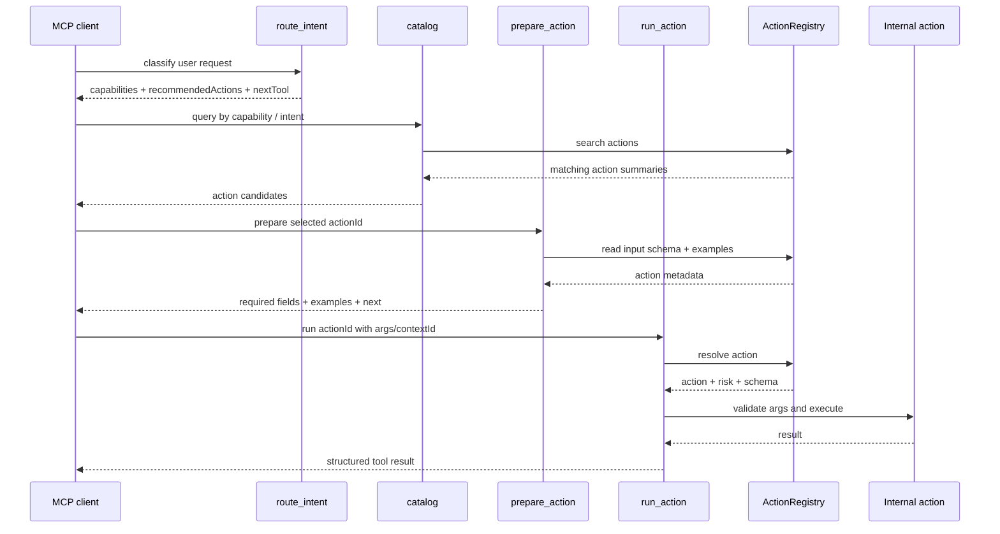
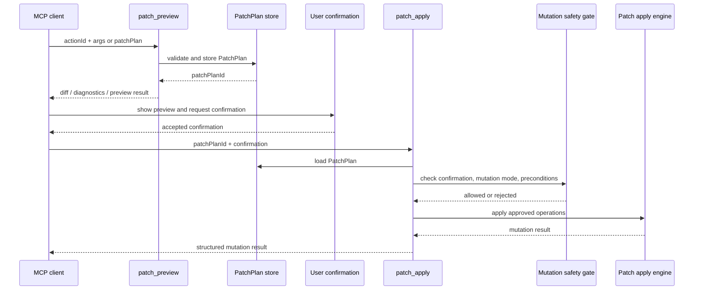

## Facade architecture map

The MCP server uses a small public facade and keeps domain-specific behavior behind an internal Action Registry.

```mermaid
flowchart TB
    Client["MCP client / LLM"]

    subgraph Public["Default public MCP surface"]
      workbench_smoke["workbench.smoke"]
      workbench_route_intent["workbench.route_intent"]
      workbench_catalog["workbench.catalog"]
      workbench_prepare_action["workbench.prepare_action"]
      workbench_run_action["workbench.run_action"]
      workbench_context["workbench.context"]
      workbench_patch_preview["workbench.patch_preview"]
      workbench_patch_apply["workbench.patch_apply"]
    end

    subgraph Registry["Internal Action Registry"]
      capability_inspect["Inspect<br/>2 actions"]
      capability_validate["Validate<br/>9 actions"]
      capability_analyze["Analyze<br/>14 actions"]
      capability_wiki["Wiki<br/>3 actions"]
      capability_skills["Skills<br/>3 actions"]
      capability_creative_context["Creative Context<br/>3 actions"]
      capability_creative_ideation["Creative Ideation<br/>5 actions"]
      capability_creative_review["Creative Review<br/>12 actions"]
      capability_creative_patch["Creative Patch<br/>6 actions"]
      capability_patch_preview["Patch Preview<br/>6 actions"]
      capability_patch_apply["Patch Apply<br/>1 actions"]
    end

    subgraph Safety["Mutation safety boundary"]
      PatchStore["PatchPlan store"]
      Confirm["confirmation gate"]
      MutationMode["mutation mode"]
      ApplyEngine["canonical patch apply engine"]
    end

    Client --> workbench_smoke
    Client --> workbench_route_intent
    workbench_route_intent --> workbench_catalog
    workbench_catalog --> workbench_prepare_action
    workbench_prepare_action --> workbench_run_action
    workbench_prepare_action --> workbench_patch_preview
    workbench_context -. "hydrates args via contextId" .-> workbench_run_action
    workbench_context -. "hydrates args via contextId" .-> workbench_patch_preview
    workbench_run_action -. "blocks commit_mutation" .-> workbench_patch_apply
    workbench_patch_preview --> PatchStore
    workbench_patch_apply --> PatchStore
    workbench_patch_apply --> Confirm
    workbench_patch_apply --> MutationMode
    workbench_patch_apply --> ApplyEngine
    workbench_catalog --> capability_inspect
    workbench_catalog --> capability_validate
    workbench_catalog --> capability_analyze
    workbench_catalog --> capability_wiki
    workbench_catalog --> capability_skills
    workbench_catalog --> capability_creative_context
    workbench_catalog --> capability_creative_ideation
    workbench_catalog --> capability_creative_review
    workbench_catalog --> capability_creative_patch
    workbench_catalog --> capability_patch_preview
    workbench_catalog --> capability_patch_apply
```

### Normal read-only / preview flow

### Mutation-safe patch flow

Commit mutations are intentionally not executed through `workbench.run_action`. The facade routes file changes through preview, explicit confirmation, and the canonical patch apply gate.

### Internal action groups

| Group | Capability | Actions | Risks | Public entrypoint |
| --- | --- | ---: | --- | --- |
| Inspect | `inspect` | 2 | `read_only` | workbench.catalog → workbench.prepare_action → workbench.run_action |
| Validate | `validate` | 9 | `read_only` | workbench.catalog → workbench.prepare_action → workbench.run_action |
| Analyze | `analyze` | 14 | `read_only` | workbench.catalog → workbench.prepare_action → workbench.run_action |
| Wiki | `wiki` | 3 | `commit_mutation`, `read_only` | workbench.patch_preview → workbench.patch_apply |
| Skills | `skills` | 3 | `read_only` | workbench.catalog → workbench.prepare_action → workbench.run_action |
| Creative Context | `creative.context` | 3 | `read_only` | workbench.catalog → workbench.prepare_action → workbench.run_action |
| Creative Ideation | `creative.ideation` | 5 | `read_only` | workbench.catalog → workbench.prepare_action → workbench.run_action |
| Creative Review | `creative.review` | 12 | `read_only` | workbench.catalog → workbench.prepare_action → workbench.run_action |
| Creative Patch | `creative.patch` | 6 | `commit_mutation`, `preview_mutation`, `read_only` | workbench.patch_preview → workbench.patch_apply |
| Patch Preview | `patch.preview` | 6 | `preview_mutation`, `read_only` | workbench.patch_preview |
| Patch Apply | `patch.apply` | 1 | `commit_mutation` | workbench.patch_preview → workbench.patch_apply |

### Why this facade exists

The facade reduces the external MCP `tools/list` surface while preserving the full domain capability internally. `route_intent` decides the likely capability, `catalog` exposes relevant actions, `prepare_action` explains one action schema, `run_action` executes read-only and preview-safe actions, `context` carries large payloads by handle, and `patch_preview` / `patch_apply` isolate file writes behind preview, confirmation, mutation-mode, and precondition checks.
